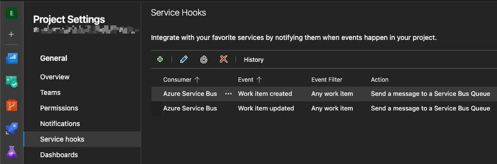

## ado-workitem-watcher

Watches for Azure DevOps Product Backlog Items that have been created or updated with a tag named "dd-required", which indicates that a Design Document is required for the work item. If the tag exists, then it will perform the following steps:

1. Create a new Wiki Page under a root folder named "Technical Design Documents" based on a [template](./app/templates/design-document.md) with a link back to the PBI.
2. Create a task under the PBI called "Complete the Design Document" with a link to the design document.
3. Create the parent/child relationship between the Task and the Work Item.

## Inspiration

I am the architect for three teams of developers. I tried numerous ways to get the teams to create documentation describing how they intend to implement the designs for the PBIs that they pick up for the sprint. After many frustrating design calls for which nobody came prepared, it occurred to me that the problem was that there was no effort allocated to the task and they were more concerned with satisfying the delivery requirements than the documentation. So my solution was to add something to which they could allocate some effort / capacity for.

## How it Works

In each Azure DevOps Project, under "Project Settings", there is a section called Service Hooks



From here, you can create various triggers that enable integrations other systems. I chose "Azure Service Bus". Next, I was prompted to select the event that I am interested in. For these, you can see that I have selected "Work item created" and "Work item updated". The next option is to select the action, and for this, I chose "Send the message to a Service Bus Queue". Then, I provided the connection string for an Azure Service Bus queue that I created in my Azure Subscription.

The Python application in this repository will watch the ASB queue that ADO writes to and process it.

## Development / Debugging

For vscode, add the following launch.json to your .vscode folder and provide values for all of the environment variables. The names should be self-explanatory.

- ASB_CONNECTION_STRING: The connection string to the Azure Service Bus that you have created for ADO use.
- ASB_QUEUE: The name of the Azure Service Bus Queue that ADO will write to.
- ADO_ORG: The Azure DevOps organization (e.g. https://**slmsrc**.visualstudio.com/POC).
- ADO_PROJECT: The Azure Devops Project (e.g. https://slmsrc.visualstudio.com/**POC**).
- ADO_PAT: A personal access token with Wiki read/write and Work Items read/write permissions.
- ASB_POLL_INTERVAL_SECONDS: The number of seconds to sleep between each check of the ASB.

```json
{
  "version": "0.2.0",
  "configurations": [
    {
      "name": "Debug ADO WorkItem Watcher",
      "type": "debugpy",
      "request": "launch",
      "program": "${workspaceFolder}/app/main.py",
      "console": "integratedTerminal",
      "env": {
        "ASB_CONNECTION_STRING": "",
        "ASB_QUEUE": "",
        "ADO_ORG": "",
        "ADO_PROJECT": "",
        "ADO_PAT": "",
        "ASB_POLL_INTERVAL_SECONDS": "5"
      }
    }
  ]
}
```

## Deployment

In my case, I have deployed this application on Azure Kubernetes Service, so I have included the [Dockerfile](./Dockerfile) and an AKS Deployment manifest ([aks-deployment.yaml](./aks-deployment.yaml)). This manifest implies the existence of a config map named `ado-work-item-watcher-config`. You can create that with kubectl, or you can use this template to create a yaml file for it.

```yaml
apiVersion: v1
kind: ConfigMap
metadata:
  name: ado-workitem-watcher-config
data:
  asb-connection-string: your-connection-string
  asb-queue: your-asbqueue-name
  ado-org: your-org-name
  ado-project: your-project-name
  ado-pat: your-pat-value
  asb-poll-interval-seconds: "60"
  wi-template-path: "/app/templates/design-document.md"
```

In my case, I have also added a deployment pipeline at [.github/workflows/docker-build.yml](./.github/workflows/docker-build.yml) that builds this and deploys it to my DockerHub repo.

## TODO

This is a work in progress and needs a lot of error handling and code refinement.

## Known Issues

Currently, if a work item is spilled over into a future sprint, the process of moving the file will trigger an update that will create a duplicate task and wiki document at the new path.
